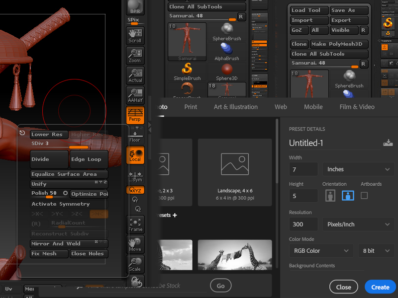

Yah, I need new GUI technologies, the browser stuff is old and brittle. I am looking to [ZBrush](https://www.google.com/search?q=zbrush+gui&tbm=isch) and [Photoshop](https://www.google.com/search?q=photoshop+gui&tbm=isch). Just at a glance I can see I need more spacing, more dark, and above all collapsible panels. Working on nicer preset selector.

GUI Ideas
