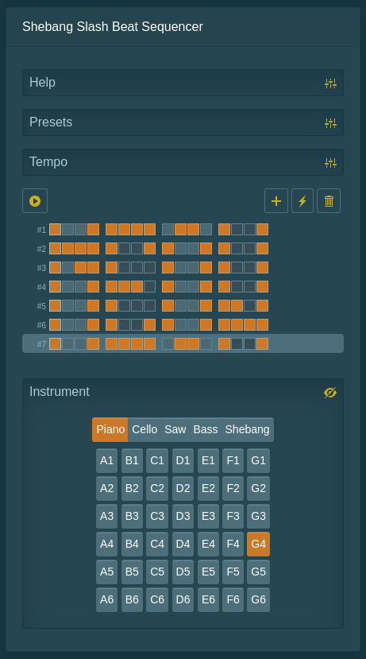

Added [Inner City, Good Life](https://github.com/fantasyui-com/catpea-com/blob/master/src/components/BeatSequencer.svelte) preset to the Beat Sequencer to test support for multiple instruments. I also added Salamander Piano, which is based on [Yamaha C5 Grand Piano](https://usa.yamaha.com/products/musical_instruments/pianos/grand_pianos/cx_series/cx-series.html), a real Piano, it sounds nice . Go to Shebang Slash Beat Sequencer, check some of those boxes to make the piano go. I set it as the default instrument.

Piano Fun
