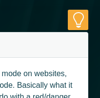

Yay, Night Mode seems to have worked out, I even gave it nice and tidy animation. [Octicons](https://octicons.github.com/) had a light bulb icon for me so it all went smoothly. Give it a try, go to the [Research](http://catpea.com/research) page, put on some shades, and click on the  icon ↑.

Night Mode Toggle
