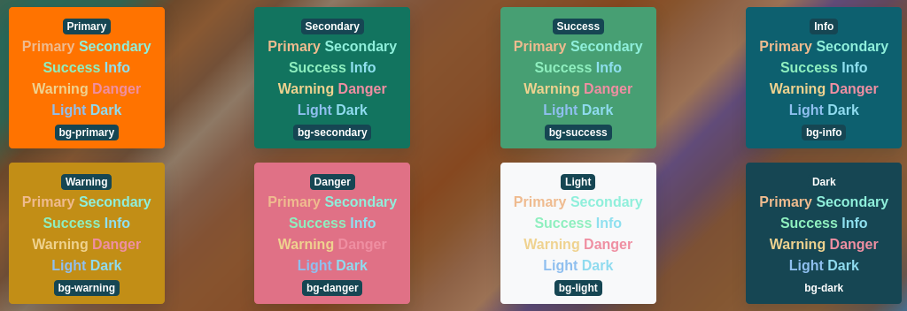

Huge problems with mixing colors. It is not really possible to use yellow on white. Now, I kind of have the "Heads up yellow is being used on white" information and and I can attempt to program a solution, but, perhaps, I am thinking about it wrong.

Huge Problems with Mixing Colors

I reset almost all text-colors on CATPEA to black. Everything looks OK. So I am at a, really, good point.

I also ran some experiments that do work, and show promising results.

Good Results via The HSL/HSV Model

The [HSL](https://www.youtube.com/watch?v=NAw2_NtGNaA)/[HSV](https://www.youtube.com/watch?v=yNgH3wv4crg) color models are more than just models. They are tools, that yield themselves to manipulating colors via color theory. In color theory we have notions of colors that are opposite on a circle, and here we have a cylinder, shaped to work with that theory.

HSL Model

It makes sense that [Bootstrap](https://getbootstrap.com/) developers wouldn't want to touch this. They are developing a framework, not really a theme.

I am developing a Theme, that heavily deals with color and several additional components.

I am going to create, what is probably going to end up being an extended color set that pushes default colors, for example red, into HSL world, creating something like red-25 red red-75, where the middle red is the actual color the user selected, but red-25 will always be half of red in terms of Saturation and Luminosity, conversely red-75 will have a-half-more of saturation and luminosity. Enough so that text in red on red-25 background will be guaranteed to be readable.

If this does not work out, then I'll create an extended palette of all colors and just name them red-dark and red-light.

And if this fails, then the only two colors the user will get to keep will be Primary and Secondary, everything else will be strictly computer generated. They will use Primary/Secondary at their own risk, and on a background that they know fits.

All these approaches are meant to eliminate color clashing, which is the number one problem in Bootstrap.
