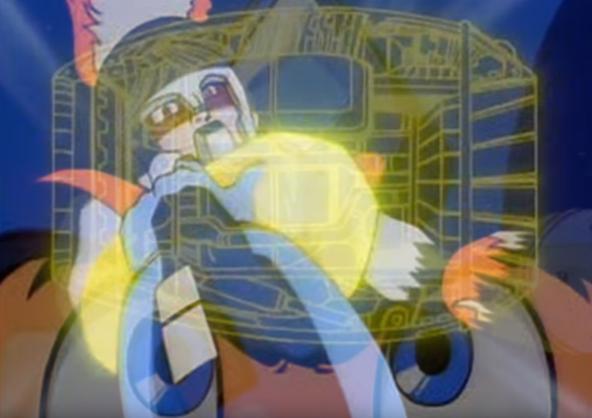

Sunday Mascot

I continue adapting my strategy for approaching automated [Bootstrap](https://getbootstrap.com/) processing. I created a program that creates a little overview of thier code for me, my program is able to understand all of their code now.

Bootstrap Code Overview

Overall, they come in with just about 5700 statements, talking about color, and text padding, and and little quirks and tricks. Looking over their work, I realized, If I touch any of this code they will hate me, with a passion.

If I am to get accepted into [Bootstrap Themes](https://themes.getbootstrap.com/)

I can't automatically process their things, I have to make copies.

For example: the Navbar on top of this web page is a lot of work, a lot of balancing and tweaking, and option adding.

The only way I can touch it, is by making a copy, calling it SuperNavbar. And here, in the SuperNavbar, I can strip down colors, and apply my magical animations, and bits, and things.

Well, that's progress. Progress with a bonus. Because at any point users can fall back on the original Navbar, and there is a couple ways to do that even. Anymore, work must arise from my Static Code Analysis here, from my little tools.

At this point the Greatest Secret in Good Programming is kicking in: Rather than doing what I think I should do. I should do what is possible to do, with a hefty dose of code integrity, and program stability.

More than that, my theme, my designs, should apply to many versions of Bootstrap, many of the [past releases](https://getbootstrap.com/docs/versions/) - that's just good programming.

Even if I stick to the v4.x branch (which is most reasonable), I will need to release 5 of 6 versions of my theme, and then maybe three more after that.

I am very well aware, what a punch in the stomach all this is to the designers. The stuff that I am working on here, is really uncomfortable for most Designers. They don't want to process abstract syntax trees, or learn programming even.

Also, a little twinkle of a business perspective is bubbling up here. Automated processing means bug free product, fast upgrades, fast support.

But still, I am not sure what I will do to automate Design, once I do have SuperNavbar, presumably with all colors removed, and I make some classes like I have in [Theme](http://catpea.com/theme) right now, to apply color to things, an interactive color, that supports mult-color-websites and multiple dark themes.

Vary some fonts, and padding, and margins. I am still stuck with, what is basically... a [basic theme](https://bootswatch.com/).

Basic Theme

I still have to come up with a Robotic Artist, that actually does [real design](http://pixelkit.com/kits/gui/).

Real Design

But... I think I know how to do that. You know how Megaman can [inherit weapons from their enemies by touch](https://youtu.be/3ufVQIUEiYc?t=40).

Design Inheritance

I think I can make some basic designs like beautifully styled boxes, and then AIM THEM AT SuperNavbar and SuperCard, and fire.

SuperNavbar would then inherit properties of those Artistic Designs, background skin, inner shadow, blend gradients. Art is actually easy. I don't think anyone should ever sit down to decorating Navbars, the decorations must be carbon copied from something simpler, and certainly more reusable. THis way multiple components can be decorated at once.

Wow, it is 2PM already. I am thinking about a lot of my programming projects at once, this coloring adventure is just relaxations.
