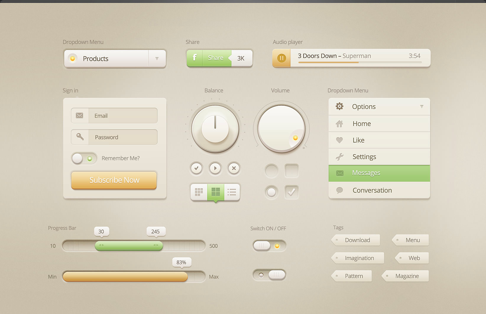

Designer GUI Preview

I have managed to create a little tool named [Designer](http://catpea.com/designer), mostly for Desktops. The tool sets only three things, the top highlight, the bottom shade, a drop shadow that it casts on the background.

Our sample image has more shadows, more blending, it is precise with its colors, and my tool can do that as well, and without making the UI much more complex.

Real Design

I am only focusing on the box around the components, so in this case it is the thing that makes the Audio Player look 3D, like it has a height.

Real Design

From what my eyes can see here, he set the top highlight to be 1 pixel, bottom shade about 6, and he is using a subtle 4 pixel drop shadow. Alone, these things are almost imperceptible,

together, they create a convincing 3D effect.

I believe this is a design by [Creative Mints](https://dribbble.com/creativemints) because I noticed [something similar](https://dribbble.com/shots/864910-Ui-Kit).

And right now, I don't have any particular design in mind. I am just focusing on creating a tool that gives a convincing 3D effect, in a language called CSS. CSS is not meant for this, but applying a couple of tricks here and there, can actually work, and efficiently, and it would be accepted by the [Bootstrap](https://getbootstrap.com/) developers as OK. I did play with this tool for a few minutes, and it needs another layer of shade, to make the bottom border more pronounced, other than that it is about done.
