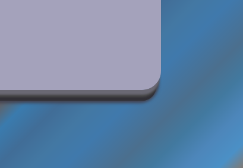
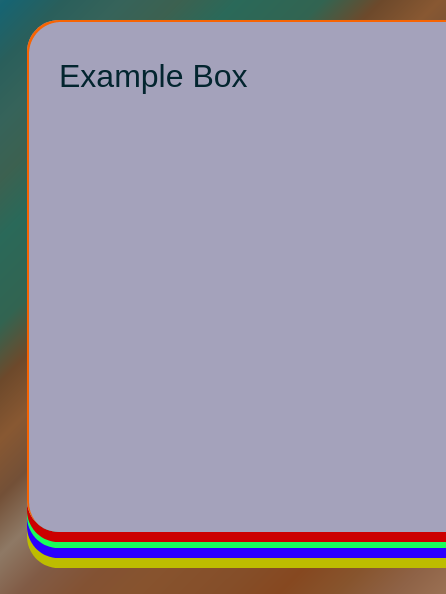

I am still working on [Designer](http://catpea.com/designer) I found some graphic artifacts with yesterday's approach, now I am creating the 3D raised effect with Drop Shadows, rather than inner shadows.

This means that I can color the inside of the box with a bit more creativity.

[Designer](http://catpea.com/designer) is still in early stages, I have to add profile support, probably restructure the flow control as well. But it will forever solve the problem of 3D raised boxes in themes.

Three Shadows to Simulate Surface

Close Up

And here is what is actually going on. This show the places where colors are placed to give a 3D effect.

Color Revelation

Color Revelation

Orange is where the highlight color lives.

Red, Green, Blue, are combined together to create smooth surface that created the 3D effect.

Yellow is the subtle Drop Shadow that is cast on the page background.
