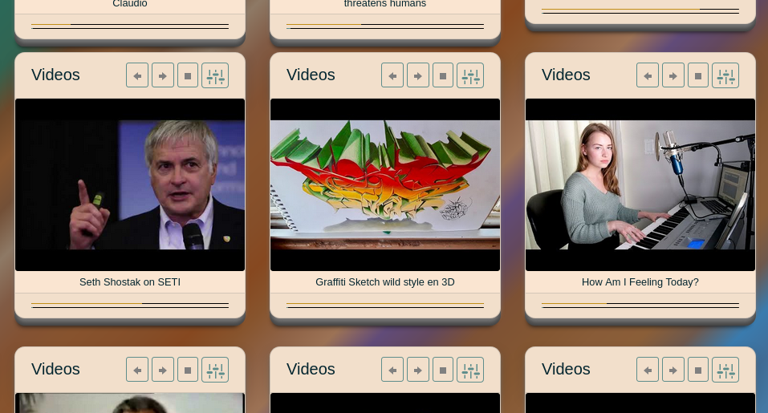

I just finished another upgrade for [Designer](http://catpea.com/designer) and it can make Ice Cream now. I also made a couple of Profiles (Lemon and Blueberry) to toggle between and the transition is animated.

Making Ice Cream

This tool should be enough to begin with interesting UI Themes.

Updated User Interface

Just to remind, my aim is a product on [Bootstrap Themes](https://themes.getbootstrap.com/) that looks something like this:

What I need to start building.

But the [CSS](https://www.youtube.com/watch?v=gT0Lh1eYk78) language is not happy about making 3D things, and artful little digital frescos, so I have to make a few little tools.

To celebrate this little programming milestone I temporarily added the "Heavy Metal" [Designer](http://catpea.com/designer) Preset to all boxes on CATPEA.

Looks Interesting

Looks Interesting
