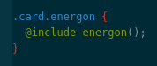
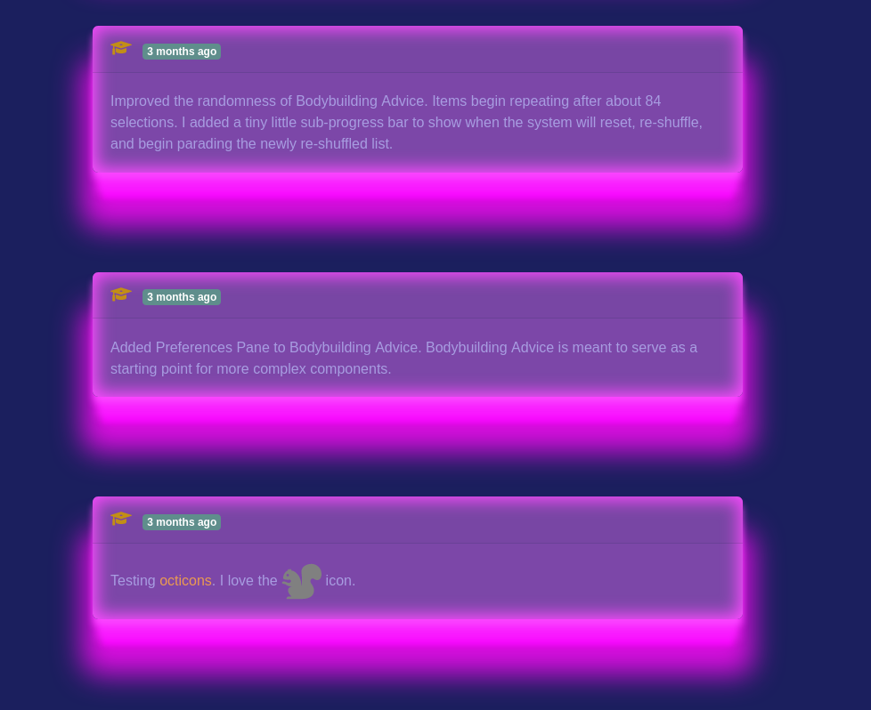
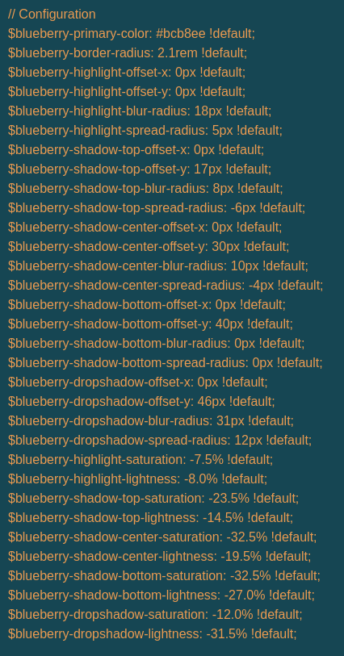

Transformer Robots Eat Energon... or something

And walk on it... sometimes.

I gave [Designer](http://catpea.com/designer) a big upgrade, it now not only generates standard CSS, but the much needed [Sass](https://sass-lang.com) CSS (known as SCSS).

This is huge, because I can copy code from [Designer](http://catpea.com/designer) and paste it into [Bootstrap](https://getbootstrap.com/) and it will just work. After the code is in Bootstrap, it takes one line to use it.

Here is what the Sass code for one of the presets (Energon) in [Designer](http://catpea.com/designer) looks like:

Energon: Installation

And here is what it takes to use it in some design:

(.card.energon means a card that has been marked as being of type energon, and a card is the boxes I use on the homepage. Card design comes from the Bootstrap team.)

Energon: Usage

And here is a crazy looking, but SUPER SERIOUS test. I am exporting information to multiple programming languages, JavaScript, CSS, and Sass. And in the case of Sass, I need to pass CONFIGURATION VARIABLES so that the customers can tweak them. I can't calculate the colors at all. That means, the Math for CSS and JavaScript has to match the Math for Scss.

This is Applied Color Theory...

I used calculations over [HSL](https://www.youtube.com/watch?v=NAw2_NtGNaA) for all three (CSS, JavaScript, and Sass) and it worked. For example Saturation of 0.5 in JavaScript, means the same thing that Saturation of 0.5 in Sass. But they each have a different way of expressing that. In JavaScript I say '\*'+(0.5+1), and in Sass I have to say ((0.5\*100 )/2).toFixed(1)

Energon Cubes: Crazy Design

And when all is said and done Compiled [Sass](https://sass-lang.com) and [Designer](http://catpea.com/designer) preview, match pixel for pixel, because of my use of [HSL](https://www.youtube.com/watch?v=NAw2_NtGNaA) Color Model. The code for both is written by different programmer for different languages.

And there is no way a person will get far, without some visual tool like the [Designer](http://catpea.com/designer).

Manipulating colors is such a freaking delicate operation, a 5% difference in Saturation and Brightness can either make a design, or make it look off and crappy.

There is no creating something like the Energon Experiment with a visual preview. Something as silly and useless as Energon required four separate revisions, to adjust blur/spread and colors, and the base color. It is just not possible without a tool.

A lot of Programmers/Designers use the browser as it has some preview/editing features.

Browser Can't help with Sass SCSS for Bootstrap

But how the heckedy heck to declare/extract variables, and generate Sass's SCSS code, that's not possible in the browser - lyke at all.

Still doing math in Sass

The code in Sass is still going to do some math based on the settings.

User's Settings

And the settings exists so that the user/customer can tweak things, they aren't really interested in building a new design, just making a slight alteration that makes sense in their business context.

One such example is removing the top-right highlight, or darkening the bottom-most blur/drop shadow to match their webpage-background.

View of the different things at play.

Now I need to make some serious presets that will get me closer to a more serious design:

Serious Design
