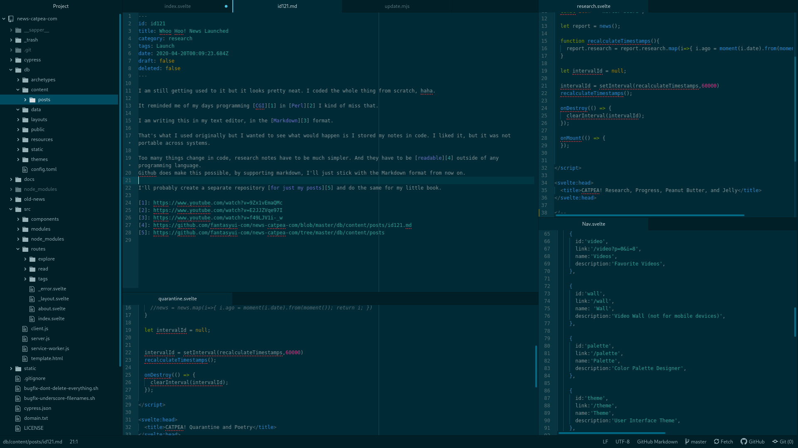

I am still getting used to it but it looks pretty neat. I coded the whole thing from scratch, haha.

It reminded me of my days programming [CGI](https://www.youtube.com/watch?v=9Zx1vEmaQMc) in [Perl](https://www.youtube.com/watch?v=E2JJZVqe97I) I kind of miss that.

I am writing this in my text editor, in the [Markdown](https://www.youtube.com/watch?v=f49LJV1i-_w) format.

 [zoom](image/research-0084-md.png)

That's what I used originally but I wanted to see what would happen is I stored my notes in code. I liked it, but it was not portable across systems.

Too many things change in code, research notes have to be much simpler. And they have to be [readable](https://github.com/fantasyui-com/news-catpea-com/blob/master/db/content/posts/id121.md) outside of any programming language. Github does make this possible, by supporting markdown, I'll just stick with the Markdown format from now on.

I'll probably create a separate repository [for just my posts](https://github.com/fantasyui-com/news-catpea-com/tree/master/db/content/posts) and do the same for my little book.
