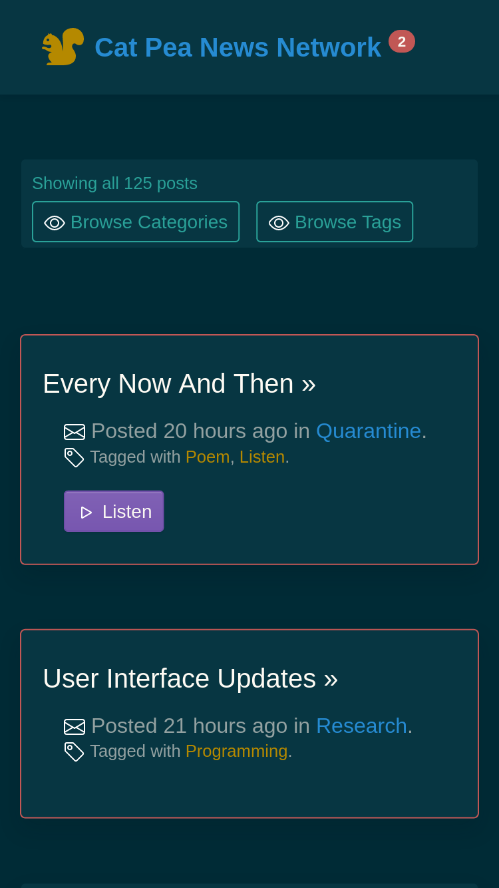

Got around to working on typography and layout.

Things look good, I tested it on desktop and mobile, very little needed reprogramming to work well on mobile.

I am learning [Bootstrap](https://www.youtube.com/watch?v=FtXd_qQJgfI) I now know what a Theme is (Colors, configuration tweaks, nothing more).

And a Theme has second part that is like an extra attachment, and that's various little useful layouts, snippets, templates. The second part is a very important extra.

With [Vue](https://www.youtube.com/watch?v=FtXd_qQJgfI) and [React](https://www.youtube.com/watch?v=0KlRgFEEz0g) being too alien for real development, [iQuery](https://www.youtube.com/watch?v=JjIvF0yikGU) dying, [WebComponents](https://www.youtube.com/watch?v=R9o9js_HKwc) being too far away, [Svelte](https://www.youtube.com/watch?v=ws97Etvs-Qs) or a framework like it will triumph. Moreover, Svelte already compiles to WebComponents, and WebComponents will forever lack (by default) a good automatic data to UI updates, because they are not designed to make programming reasonable, unlike Svelte.

These important Theme-Extras therefore, must be written in Svelte. And Cat Pea, is a prime example of what an Extra would look like. All those little boxes, little menus, little drawers, bits of Music Making, Bodybuilding Advice, all of that are snippets of code that will make this theme sell. The news site, is not a good snippet, it should be included, but it is too monolithic, it is just buttons for browsing posts.

I will need to redesign Cat Pea with that in mind, so my programming adventure is also making a tiny product for [Bootstrap Themes](https://themes.getbootstrap.com/). Anyhow, here are the newly added UI improvements.

Here is the new Home Page, it looks like an App, because the user is browsing All Posts at first. I think it would be better to create a Home Page that first opens to 5 latest posts, and I may do that later.

This is Category View, it is a lot cleaner, but it is very busy. I basically turned 3 words (Research, Quarantine, Theme) into a web page, but this is probably more sustainable as far as writing a lot of articles goes.

And this is what reading a post looks like now. I'll have toggle tat off into a mini miniature, I'd like to see just the post here, I'll add a "Quick Nav" box and when that's opened the quick navigation features will show up. Reading a post should just be about a post.

I like the Listen button, and I like the fact that it fits well on the home page.

The one big change is that there is no more Player, the user has to click the button to see it. This is because every browser has it's own player. The stablest method is to add the button that just links to the mp3 file.

I also setup an external repository for my writing over on [Github](https://github.com/fantasyui-com/news) it is not easy to navigate, but if I ever lose catpea.com domain name, or github is down, or technology changes, there is always this external master that has all the text and poems and my [recordings](https://github.com/fantasyui-com/news/tree/master/poems) mostly accessible. I want the 70 year old me, to be able to access this and be really embarrassed and filled of regret about how he wasn't a serious person when he had a chance. The heck with that guy.
