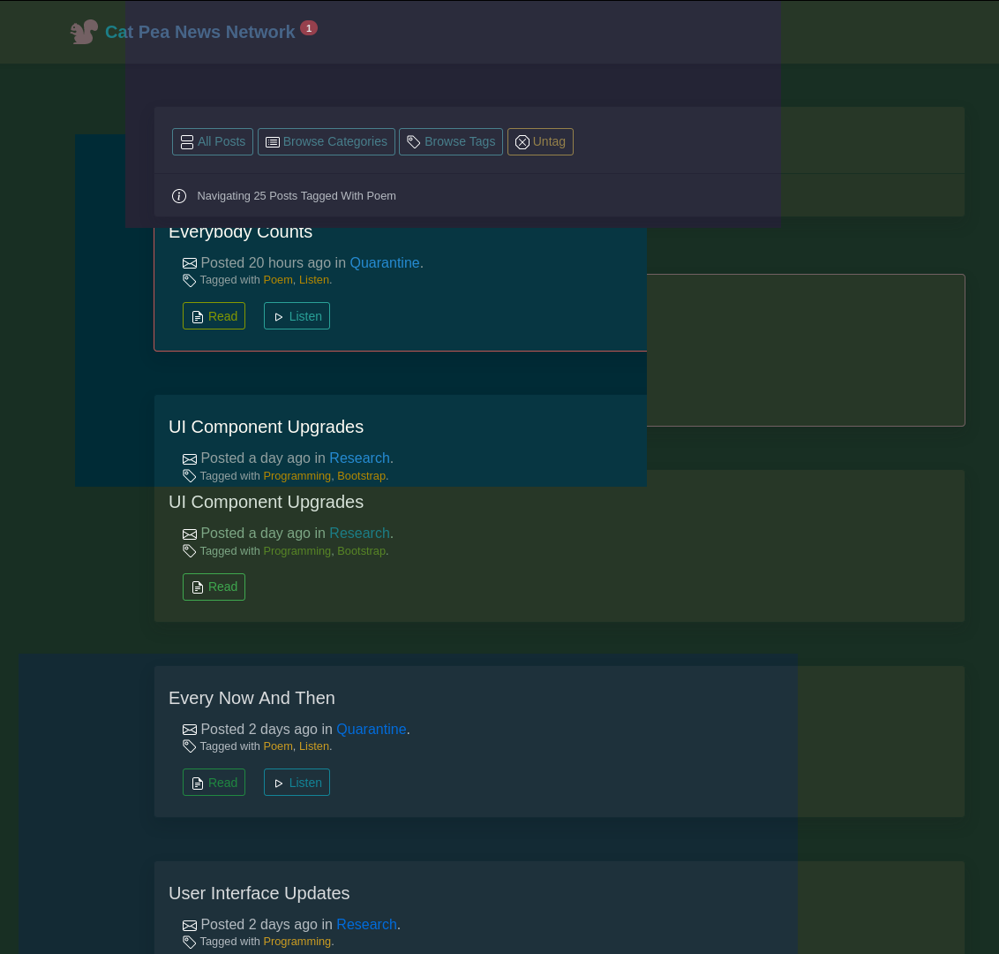

I had a piece of bread with my Raspberry Salad today, I've been programming like a madman.

I created couple of commands to update the [github mirror of my posts](https://github.com/fantasyui-com/news/blob/master/README.md), it has a little [templating system](https://github.com/fantasyui-com/news/blob/master/add.sh) in [Bash](https://www.youtube.com/watch?v=2hz7-v2f1sA), so I can say:

add poem 
or 
add research

and it will create a post blank with a proper time-stamp and id. Ready for poems, and long winds, as they say in Wales.

And I updated the [Palette Tool](https://catpea.com/palette) on [Cat Pea](https://catpea.com/) to crank out pretty gosh darn readable Color Themes, here is an abstract montage of Purple Dark Pastels, Green Trinity Matrix, and desaturated Blue Navy.

I still have to adjust a tool that makes use of that data over in [news.catpea.com](https://news.catpea.com/), but it is all looking pretty good. Here is a [mirror of this post](https://github.com/fantasyui-com/news/blob/master/posts/id127.md) on github.
