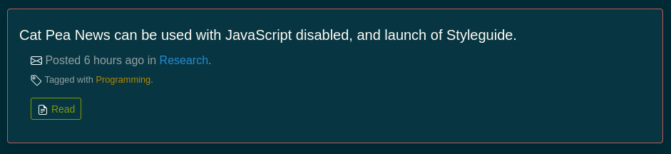

I had to rewrite a bunch of code to prefix variables with a dollar sign, that is a huge problem for Svelte adoption.

This person ran into the [same problem](https://stackoverflow.com/questions/60045404/svelte-read-nested-store), it is hard to form an opinion on the matter as I am still learning svelte.

There are other much smaller anomalies.

And then the issue of the graphic language (CSS) not being dynamically editable.

Svelte is still the best framework, but I think another one will evolve from Svelte.

The two or three leading Svelte ancestors (in general, not approach wise) [Angular](https://angular.io/), [React](https://reactjs.org/) and [Vue](https://vuejs.org/), are even worse.

This small svelte problem, is still nothing compared to the mess [React](https://reactjs.org/), [Vue](https://vuejs.org/), and [Angular](https://angular.io/) are creating.

Svelte is an important experience, because it has unearthed the future of all programming.

But, today writing code for Svelte, is just that. I will not be able to use Svelte code in future JavaScript code.

Someone did a nice write up [here](https://github.com/feltcoop/why-svelte), much better analysis than mine.

It is 2020, things should be further along than this.

Anyway, 98% of Svelte+Sapper is good, my concern is that they will fail to follow JavaScript development path, and conventions, and the newer version will have more of the [same problem problems](https://stackoverflow.com/questions/60045404/svelte-read-nested-store).

Cat Pea News, however is doing great, not when JavaScript is disabled the _Time ago time-stamps_ fall back on normal dates, as they can't be calculated since dynamic programming is off. This took very little work. It is the same code-base, but when there is no programming in the browser, dynamic features fall back, and look great!

Here is an example of the "ago time" calculation:

And here is what hapends when that catculation can't be made the browser has disabled JavaScript:

