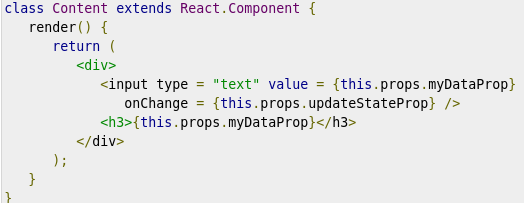

Well, I woke up, looked at my screen and the time stamps were off. Cat Pea News was open on my screen and, it makes sense that all time stamps need to keep perfect time.

Ok, so I went back on what I said yesterday, I removed the custom Svelte store I wrote, and simplified/duplicated code and got that simple Svelte syntax back. With the simple syntax, I rewrote time-ago (ex: Updated 1 hour ago) everywhere, including categories, which track time of the latest post, there is category layer above that that stores that time, it is like a double update:

1.  I first scan the database updating the ago text for each post.
2.  I make a category database, and update that when cost ago stamps change.

While I was doing this, it occurred to me that I should use a top down component model. Meaning, data lives on top, all the changes happen to it on top, and then data cascades down into all the pages, and then, page components.

Normally, that's how applications are made. But Cat Pea News, is not just Svelte, it is also Sapper a static file server...

And of course the point being, that no JavaScript is needed to read news.

So, google can index my content archive.org can mirror my content, and they don't need to execute my JavaScript.

It is just the principle alone: If a website is not a Dynamic Application, it should not require JavaScript for operations.

As I mentioned yesterday, the time ago feature of posts is disabled in a no JavaScript environment, and friendly Date appears.

My demand for a Non-JavaScript website, and my use of Sapper, skewed my research into Svelte.

I am not ready to complain about it yet.

Cat Pea News is too unique.

The fancy thing is, I learned a lot about Svelte, yeah, so when I come back to dynamic applications NO CUSTOM STORES (custom memory/database work) because that does not get equal treatment under svelte and forces special syntax, and cascading requirements.

It appears that Custom Svelte Stores are my only real problem. If use the Top Down application architecture, then I don't have that problem.

Svelte Sapper is best for applications, and it is better than everything else for static websites.

This is still the best in everything, but it is not the Perfect Compiler I expected.

It helped me define my expectations as well.

I want reactive data, reactive CSS, reactive HTML, and I want it all to keep to JavaScript, XML (HTML), CSS conventions.

These parts are so complex, that their interaction would require months of research.

It is amazing how many clever ideas span the [Svelte](https://svelte.dev/), [React](https://reactjs.org/), [Vue](https://vuejs.org/) and [Angular](https://angular.io/) universe.

Maybe, the correct solution to Applications/Websites is not all code. But it will require Visual Programming Tools. With another abstraction layer over a programming language, the gravity of code duplication, meta-programming, documentation, maintenance shifts and may a allow a perfect programming language, but that is far and different universe, it has nothing to do with Svelte.

It is worth mentioning that I looked at [Sweet.js](https://www.sweetjs.org/) this morning, as I sometimes do. It is meta-programming or super-programming for JavaScript, and I was able to define one property of a proper language: LOW CODE DENSITY. This means that the language is suited for the task at hand and need not be twisted. Custom Stores in Svelte cause twisting:

In React, a three line example is enough to show twisting:

With meta-programming, with super-programming that code can reduced to a single clean statement. And meta-programming will work for all languages. Svelte uses meta-programming, the layer for custom stores is just not complete, or or is meant to be more flexible.

Maybe, Low Code Density, or Untwisted Code can only be achieved on per project basis, and only with meta-programming.

After all Svelte's Might is the Meta Programming setup.

I a glad I mention [Sweet.js](https://www.sweetjs.org/) here.

Then there is the question of HTML vs Flex/Swing, or question of Containers and Components like old [Dojo](https://dojotoolkit.org/) is/was [doing](https://dojotoolkit.org/documentation/tutorials/1.10/dijit_layout/). A high level nestable container framework would cut down on UI code considerably. Combination of Meta Programming (to obscure reactive boilerplate) and Components/Containers could potentially create a Rapid Application Development platform with code worth reading. A sane Visual Programming Environment on top of that, could really speed up large application development.

Back to Applications, and goodness I need to make a Raspberry Lettuce Salad for lunch.
